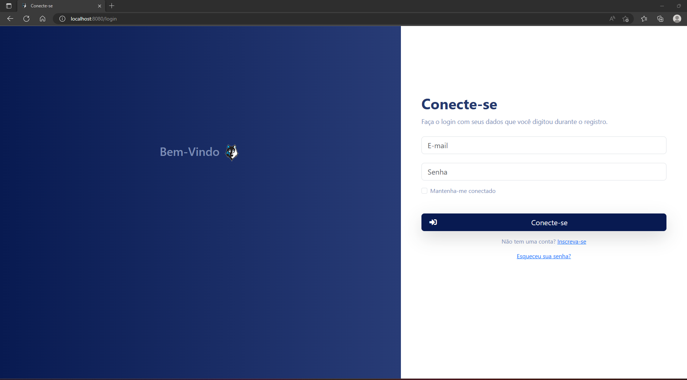
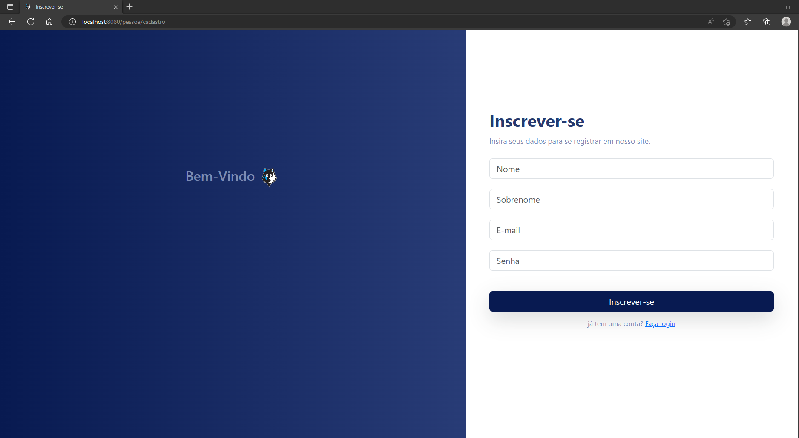
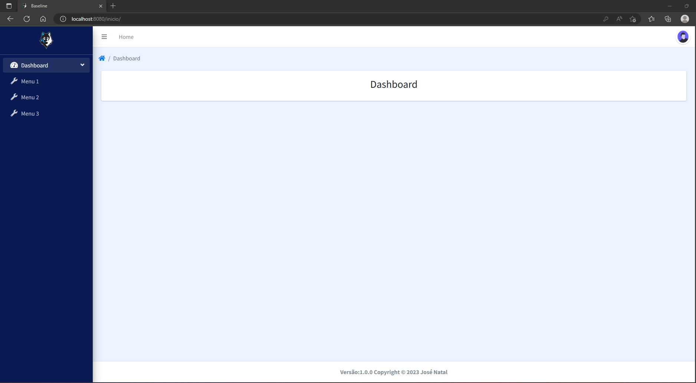
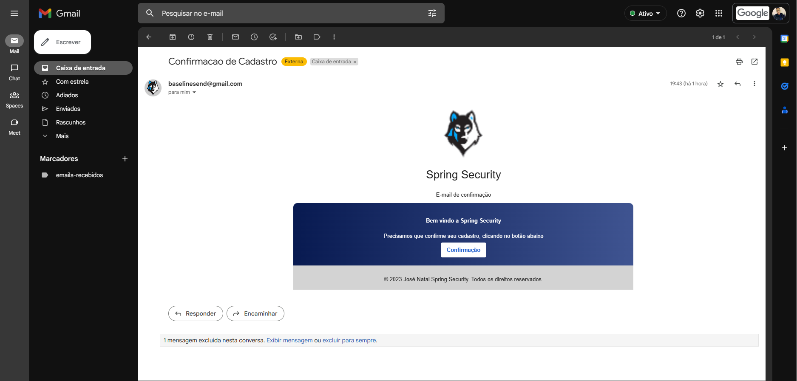
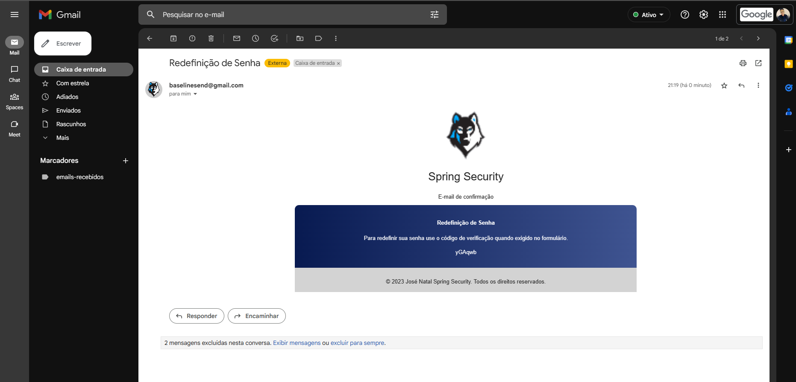
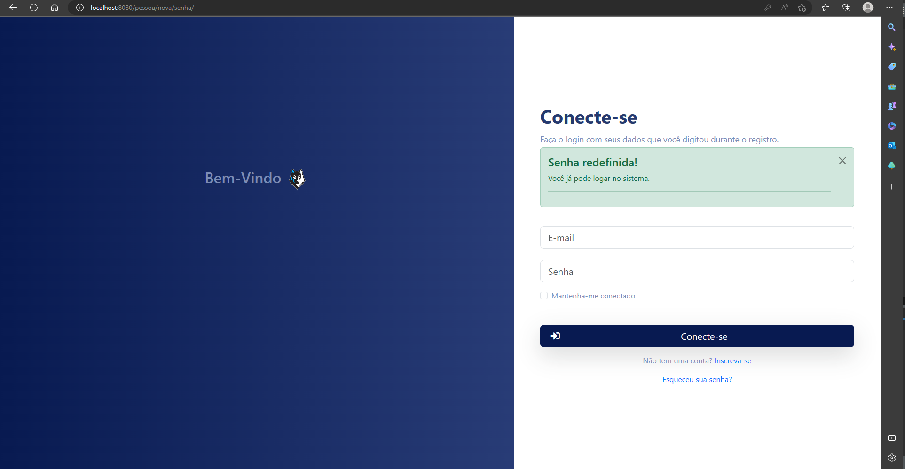

# Projeto baseline
## 🚀 Começando
Sistema de cadastro com autenticação por E-mail e redefinição de senha. 
### 🔧 Tecnologias usadas
* Spring boot 3.0.2
    * spring security
    * devtools
    * starter-web
    * jpa
    * validation
    * starter-mail
* thymeleaf 
* bootstrap 5
* JavaScript
* Java 17
* mysql
* jquery
  
## 📌 Preview de algumas páginas 
## página Login

## página Cadastro de Usuários

## página Home

## Envio de Confirmação de cadastro no E-mail

## Envio de Redefinição de senha no E-mail

## Mensagem de sucesso na redefinição de senha

